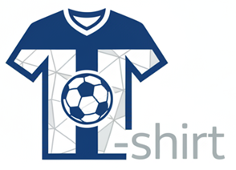

<a name="readme-top"></a>

<div align="center">
  <br />
  <a href="https://github.com/La-Salle-Gracia-FP/projecte-d-inform-tica-back-richard_stallman">
    
  </a>

  <h1 align="center">PerfecT-shirt - Backend API</h1>

  <p align="center">
    <strong>Plataforma de comercio electrónico y subastas de camisetas de fútbol.</strong><br>
    Una API RESTful completa para gestionar usuarios, productos, subastas, pedidos y paneles de administración, integrando autenticación segura y funcionalidades avanzadas construida con Laravel 12.
  </p>

  <p align="center">
    <a href="https://github.com/La-Salle-Gracia-FP/projecte-d-inform-tica-back-richard_stallman"><strong>Explore the docs »</strong></a>
  </p>

  <br />

  <p align="center">
    
    &nbsp;
    
    &nbsp;
    
  </p>

  <p align="center">
    
    &nbsp;
    
    &nbsp;
    
    &nbsp;
    
  </p>
</div>

---

## Table of Contents

- [About The Project](#about-the-project)
- [Contributors](#contributors)
- [Built With](#built-with)
- [Getting Started](#getting-started)
  - [Prerequisites](#prerequisites)
  - [Installation](#installation)
- [Database Structure](#database-structure)
- [API Endpoints](#api-endpoints)
- [License](#license)
- [Acknowledgments](#acknowledgments)

---

## About The Project

Bienvenido al repositorio del backend de **PerfecT-shirt**, una plataforma de comercio electrónico y subastas de camisetas de fútbol construida con **Laravel 12**.

Este proyecto proporciona una API RESTful completa para gestionar usuarios, productos, subastas, pedidos y paneles de administración, integrando autenticación segura y funcionalidades avanzadas.

### Funcionalidades Principales

#### 1. Autenticación y Autorización
- Registro y login de usuarios con tokens de seguridad (Laravel Sanctum).
- Inicio de sesión rápido con Google (Laravel Socialite).
- Recuperación de contraseñas y verificación de cuentas mediante códigos.
- Gestión de perfiles de usuario.
- Roles de usuario (Administrador, Cliente) para proteger rutas sensibles mediante middlewares.

#### 2. Gestión de Productos y E-Commerce
- Catálogo de camisetas deportivas con soporte para diferentes equipos y categorías.
- Descuentos aplicables a productos.
- Carrito de compras y gestión del proceso de pago (Checkout).
- Personalización de camisetas (dorsales, nombres y detalles adicionales).
- Historial de pedidos y productos asociados.

#### 3. Sistema de Subastas (Bidding)
- Subastas diarias de productos y camisetas exclusivas.
- Los usuarios autenticados pueden realizar pujas (ofertas) en tiempo real.
- Historial de ofertas y control para determinar la puja ganadora.

#### 4. Panel de Administración
- Rutas protegidas exclusivamente para usuarios con rol `admin`.
- Panel de estadísticas generales del rendimiento de la tienda.
- Gestión completa de usuarios (visualización, eliminación y cambio de roles).
- Control exhaustivo del catálogo de productos y supervisión de las subastas activas y cerradas.

#### 5. Notificaciones y Soporte
- Sistema de notificaciones integradas para alertar a los usuarios (por ejemplo, estados de cuentas, avisos de sistema).
- Tickets de soporte y valoraciones de los clientes para establecer comunicación con el equipo de administración.

#### 6. Integraciones Externas
- Consumo de APIs de terceros para importar el catálogo de camisetas de forma automática (`/api/importar-camisetas`).
- Obtención de noticias actualizadas sobre el mundo del fútbol (`/api/noticias-futbol`).

<p align="right"><a href="#readme-top">back to top</a></p>

---

## Contributors

| Name | Email | Role |
|:---|:---|:---|
| **Diego García Senciales** | diegosenciales@gmail.com | Developer |
| **Aleix Rodriguez Muñoz** | rodriguezaleix06@gmail.com | Developer |
| **Oriol Corbella** | uriolcorbella06@gmail.com | Developer |
| **PerfecT-shirt Team** | noreply.perfectshirt@gmail.com | General Contact |

<p align="right"><a href="#readme-top">back to top</a></p>

---

## Built With

<div align="center">
  <a href="https://laravel.com/">
    
  </a>
  &nbsp;
  <a href="https://www.php.net/">
    
  </a>
  &nbsp;
  <a href="https://www.mysql.com/">
    
  </a>
  &nbsp;
  <a href="https://www.docker.com/">
    
  </a>
</div>

- **Framework:** Laravel 12 (PHP 8.2+)
- **Autenticación:** Laravel Sanctum (Tokens API) y Laravel Socialite (Login con Google)
- **Base de datos:** MySQL / SQLite
- **Entorno de desarrollo:** Docker (Laravel Sail), Vite

<p align="right"><a href="#readme-top">back to top</a></p>

---

## Getting Started

### Prerequisites

- PHP 8.2 o superior
- Composer
- Node.js y npm
- Servidor de base de datos (MySQL, MariaDB o SQLite)

### Installation

1. **Clonar el repositorio:**
   ```sh
   git clone https://github.com/La-Salle-Gracia-FP/projecte-d-inform-tica-back-richard_stallman.git
   cd projecte-d-inform-tica-back-richard_stallman
   ```

2. **Instalar dependencias de PHP y Node:**
   ```sh
   composer install
   npm install
   ```

3. **Configurar las variables de entorno:**
   Copia el archivo de ejemplo y configura tu conexión a la base de datos y credenciales (ej. Google Client ID para Socialite).
   ```sh
   cp .env.example .env
   php artisan key:generate
   ```

4. **Ejecutar las migraciones de la base de datos:**
   ```sh
   php artisan migrate
   ```

5. **Iniciar el servidor local:**
   ```sh
   php artisan serve
   ```
   *Nota: Si utilizas Docker, también puedes levantar el proyecto usando Laravel Sail ejecutando `./vendor/bin/sail up -d`.*

<p align="right"><a href="#readme-top">back to top</a></p>

---

## Database Structure

El sistema cuenta con una arquitectura de base de datos detallada, diseñada para soportar todas las operaciones de la tienda y las subastas. A continuación se detallan las tablas principales agrupadas por dominio:

| Dominio | Tablas Principales | Descripción |
|:---|:---|:---|
| **Usuarios y Personas** | `users`, `_persona`, `_administrador`, `_registro__admin` | Gestión de identidades, perfiles, roles y logs de administración. |
| **Catálogo** | `_producto`, `_categorias`, `_equipo`, `_descuentos` | Entidades para productos, clasificación, equipos y promociones. |
| **Subastas** | `_pujas`, `_ofertas__pujas` | Control de las subastas activas y registro de ofertas de los usuarios. |
| **Compras** | `_pedidos`, `_productos__pedido`, `_pagos`, `_carrito`, `_personalizacion` | Flujo completo de compras, desde el carrito hasta el pago y personalización. |
| **Interacción** | `notificacions`, `_ticket__soporte`, `_valoraciones` | Comunicación con el usuario, alertas y sistema de soporte técnico. |
| **Configuración** | `_moneda`, `_idioma`, `_cookies` | Ajustes globales y preferencias del sistema. |

<p align="right"><a href="#readme-top">back to top</a></p>

---

## API Endpoints

| Método | Endpoint | Descripción | Acceso |
|--------|----------|-------------|---------|
| `POST` | `/api/login` | Autenticación y obtención de token | Público |
| `POST` | `/api/register` | Registro de nuevo usuario | Público |
| `GET`  | `/api/auth/google` | Redirección OAuth con Google | Público |
| `GET`  | `/api/subastas/diarias` | Listado de subastas activas | Público |
| `POST` | `/api/subastas/{id}/pujar` | Realizar una oferta de subasta | Autenticado |
| `PUT`  | `/api/perfil` | Actualizar datos personales del usuario | Autenticado |
| `GET`  | `/api/admin/stats` | Estadísticas del dashboard de la tienda | Administrador |
| `GET`  | `/api/admin/users` | Listado general de usuarios | Administrador |
| `GET`  | `/api/notificaciones` | Historial de notificaciones del usuario | Autenticado |

<p align="right"><a href="#readme-top">back to top</a></p>

---

## License

Distributed under the **MIT License**. See [`LICENSE.txt`](https://github.com/La-Salle-Gracia-FP/projecte-d-inform-tica-back-richard_stallman?tab=MIT-1-ov-file) for more information.

<p align="right"><a href="#readme-top">back to top</a></p>

---

## Acknowledgments

- [Laravel](https://laravel.com/)
- [Laravel Sanctum](https://laravel.com/docs/11.x/sanctum)
- [Laravel Socialite](https://laravel.com/docs/11.x/socialite)
- [Img Shields](https://shields.io)

<p align="right"><a href="#readme-top">back to top</a></p>
